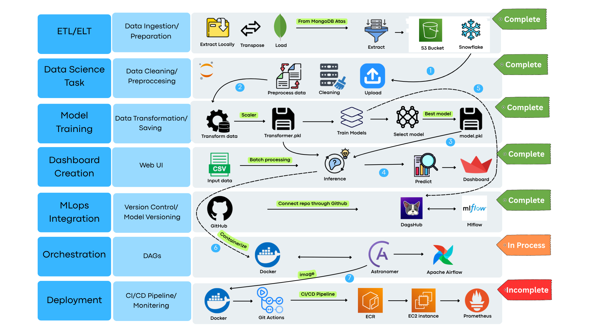
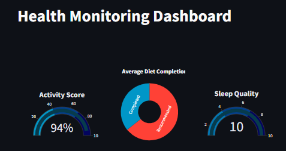

# ⌚ Smart Health Recommender System

> A project that integrates smartwatch API data to provide personalized recommendations on physical activity, diet, and sleep quality, rated on a 10-point scale.

---

## 📚 Table of Contents

- [About](#about)
- [Features](#features)
- [Project Structure](#project-structure)
- [Installation](#installation)
- [Usage](#usage)
- [Technologies Used](#technologies-used)
- [Roadmap](#roadmap)
- [Contact](#contact)

---

## 📖 About

This project leverages smartwatch API data to generate personalized health and wellness recommendations across three key areas:

- 🏃‍♂️ **Activity**: Suggests how much physical activity a user should aim for daily.
- 🍎 **Diet**: Provides personalized dietary suggestions.
- 😴 **Sleep**: Rates sleep completion on a scale of 1–10 to help users optimize rest.

### 🧩 What problem does it solve?

Many users track fitness data but struggle to interpret or use it meaningfully. This project transforms raw smartwatch data into actionable guidance, helping individuals improve daily habits, wellness, and long-term health outcomes.

---

## ✨ Features

- 📊 Interactive dashboard built using Streamlit
- 🔍 Personalized recommendations engine
- 🧠 Data-driven insights using machine learning
- 🛠️ **Upcoming:**
  - Integration with Apache Airflow for orchestration
  - CI/CD automation via GitHub Actions
  - Docker containerization

---
# Key Dependencies
- python-dotenv, pyyaml
- pandas, numpy, scikit-learn, scipy
- matplotlib, seaborn, plotly
- pymongo, certifi
- mlflow, dagshub, joblib
- streamlit 

---
# 🚀 Usage
python dashboard.py

# 🛠 Technologies Used
Languages: Python

Frameworks: Flask (planned), Streamlit (dashboard)

Libraries: Pandas, NumPy, Scikit-learn, Matplotlib, Seaborn, Plotly

Database: MongoDB Atlas

Experiment Tracking: MLflow

Version Control & Hosting: Git, GitHub

Automation & CI/CD: GitHub Actions (planned)

Orchestration: Apache Airflow (in process)

Others: Docker (in process)

# 🛣 Roadmap
`r`n`r`n## 📸 Output`r`n

